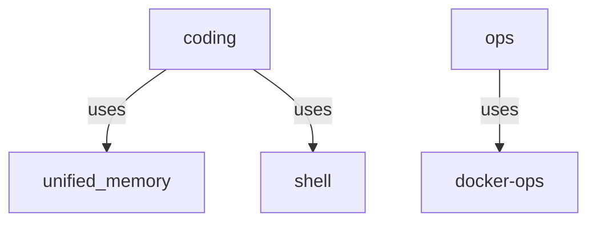

# CBW Debug & Analysis Tools - Complete Guide

## 🆕 New Tools Built

### 1. Script Debugger (`cbw_debug.py`)
**Purpose:** Find and fix common issues in shell/Python scripts

**Features:**
- Detects missing shebang, strict mode, error handling
- Finds unquoted variables, hardcoded paths
- Identifies bare except clauses, wildcard imports
- Runs shellcheck/pylint if available
- Suggests automatic fixes

**Usage:**
```bash
cbw-debug script.sh              # Full debug report
cbw-debug script.sh --flow      # Show control flow
cbw-debug script.sh --fixes     # Show suggested fixes
cbw-debug --batch *.sh          # Debug multiple scripts
```

**Example Output:**
```
DEBUG REPORT: setup_ai.sh
======================================================================
📊 Overview
  Total lines: 36
  Issues: 0
  Warnings: 7
  Suggestions: 0

⚠️  Warnings
  Line 17: Unquoted variable: SKILL_SRC="$HOME/...
  Line 22: cd without error check (add "|| exit 1")

🔧 Functions (3)
  - main()
  - setup_skill()
  - cleanup()

🌐 External Tools
  - curl
  - psql
  - docker
```

### 2. Structure Analyzer (`cbw_analyze.py`)
**Purpose:** High-level architecture and code metrics analysis

**Features:**
- Directory structure visualization
- Code metrics (lines, comments, blanks)
- Architecture pattern detection (MVC, CLI, library)
- Module dependency mapping
- Entry point identification

**Usage:**
```bash
cbw-analyze                     # Full architecture report
cbw-analyze --structure         # Directory structure only
cbw-analyze --metrics           # Code metrics only
cbw-analyze --deps              # Dependencies only
cbw-analyze --path ~/myproject  # Analyze specific path
```

**Example Output:**
```
CODE STRUCTURE ANALYSIS
======================================================================

📁 Directory Structure
  Root: /home/cbwinslow/dotfiles/ai
  Total directories: 142
  Total files: 1,247

  By file type:
    .py                139 files
    .md                102 files
    .sh                 47 files
    .yaml               56 files

🏗️  Architectural Patterns Detected
  ✓ CLI Tools
  ✓ Library
  ✗ MVC
  ✗ Plugin Based

📊 Code Metrics
  Total lines: 99,305
  Code lines: 76,692
  Comment ratio: 5.9%
  Average file size: 156 lines
```

### 3. Architecture Visualizer (`cbw_visualize.py`)
**Purpose:** Visualize code architecture and component relationships

**Features:**
- Tree view of components
- Mermaid diagram generation
- Data flow visualization
- Component relationship mapping

**Usage:**
```bash
cbw-visualize                   # Full visualization
cbw-visualize --tree            # Tree view
cbw-visualize --mermaid       # Generate Mermaid diagram
cbw-visualize --flow          # Data flow view
cbw-visualize --summary       # Complete summary
```

**Example Output:**
```
ARCHITECTURE VISUALIZATION
======================================================================

Code Architecture
==================================================
📦 dotfiles/ai/
  ├── 📁 agents/ (3 items)
  │   ├── 🤖 coding
  │   ├── 🤖 ops
  │   └── 🤖 research
  ├── 📁 skills/ (12 items)
  │   ├── ⚡ unified_memory
  │   ├── ⚡ shell
  │   └── ⚡ docker-ops
  ├── 📁 scripts/ (11 items)
  │   └── 📦 organization_tools
  │       ├── 🔧 cbw_debug
  │       ├── 🔧 cbw_analyze
  │       └── 🔧 cbw_visualize

Data Flow
==================================================
  1. 📥 Indexing
     RAG system indexes files
      ↓
  2. 🔍 Analysis
     Tools analyze patterns
      ↓
  3. 📊 Reporting
     Generate insights
      ↓
  4. 🤖 Agent Support
     AI agents use insights

Mermaid Diagram
--------------------------------------------------

```

---

## 🔧 Complete Tool Suite

### Organization & Reuse
| Tool | Command | Purpose |
|------|---------|---------|
| Knowledge Base | `cbw-help "question"` | Query indexed data |
| Pattern Analyzer | `cbw-pattern` | Find reusable patterns |
| Reuse Finder | `cbw-reuse --report` | Find code reuse opportunities |
| Task Tracker | `cbw-tasks --scan` | Track TODOs |
| Config Validator | `cbw-validate` | Validate agent configs |
| Auto-Documenter | `cbw-doc script.sh` | Generate docs |
| Template Generator | `cbw-template --list` | Create templates |

### Debug & Analysis (NEW)
| Tool | Command | Purpose |
|------|---------|---------|
| Script Debugger | `cbw-debug script.sh` | Debug scripts |
| Structure Analyzer | `cbw-analyze` | High-level architecture |
| Visualizer | `cbw-visualize` | Visual architecture |
| Dependency Mapper | `cbw-deps` | Map dependencies |

### Documentation
| Tool | Command | Purpose |
|------|---------|---------|
| agents.md Generator | `cbw-agents-md` | Auto-document directories |

---

## 🚀 Quick Start Guide

### 1. Setup
```bash
# Add to ~/.zshrc
source ~/dotfiles/ai/scripts/cbw-shell-integration.sh

# Or run setup
bash ~/dotfiles/ai/scripts/setup_organization.sh
```

### 2. Debug a Script
```bash
# Check for issues
cbw-debug ~/dotfiles/ai/setup_ai.sh

# See control flow
cbw-debug setup_ai.sh --flow

# Get fixes
cbw-debug setup_ai.sh --fixes
```

### 3. Analyze Architecture
```bash
# Full architecture report
cbw-analyze --path ~/dotfiles/ai

# Just metrics
cbw-analyze --metrics

# Dependencies
cbw-analyze --deps
```

### 4. Visualize
```bash
# Tree view
cbw-visualize --tree

# Mermaid diagram for docs
cbw-visualize --mermaid > architecture.md

# Complete summary
cbw-visualize --summary
```

### 5. Complete Workflow
```bash
# Before starting work
cbw-analyze --path .          # Understand structure
cat agents.md                 # Read directory guide

# While coding
cbw-debug myscript.sh         # Check for issues
cbw-reuse --similar-to myscript.sh  # Find similar code

# After finishing
cbw-tasks --scan              # Find TODOs
cbw-analyze --metrics         # Check code health
cbw-agents-md                 # Update docs
```

---

## 📊 What Each Tool Finds

### Debugger Finds:
- **Issues:** Missing shebang, syntax errors
- **Warnings:** Unquoted variables, hardcoded paths, missing error handling
- **Suggestions:** Use $() instead of backticks, add strict mode

### Analyzer Finds:
- **Structure:** Directory depth, file distribution
- **Patterns:** MVC, CLI tools, library structure
- **Metrics:** Lines of code, comment ratio, largest files
- **Dependencies:** Module imports, cross-references

### Visualizer Shows:
- **Tree:** Hierarchical component view
- **Relationships:** How agents use skills
- **Flow:** Data through the system
- **Diagrams:** Mermaid for documentation

---

## 💡 Use Cases

### Debugging
```bash
# Script not working?
cbw-debug broken_script.sh

# Check for common mistakes
cbw-debug --batch *.sh
```

### Understanding Codebase
```bash
# New to a project?
cbw-analyze --path ~/new-project
cbw-visualize --tree

# Find the main entry points
cbw-analyze --path . | grep "Entry Points"
```

### Refactoring
```bash
# Before refactoring
cbw-analyze --deps             # Understand dependencies
cbw-reuse --report             # Find duplicates

# After refactoring
cbw-debug refactored_script.sh # Verify no issues
cbw-analyze --metrics          # Check health
```

### Documentation
```bash
# Generate architecture diagram
cbw-visualize --mermaid > docs/architecture.md

# Document directory
cbw-agents-md ~/myproject

# Get script docs
cbw-doc complex_script.sh
```

---

## 🔗 Integration

### Pre-commit Hook
```bash
#!/bin/bash
# .git/hooks/pre-commit
cbw-debug *.sh
cbw-validate
```

### CI/CD Pipeline
```yaml
# .github/workflows/analysis.yml
- name: Code Analysis
  run: |
    cbw-analyze --metrics
    cbw-reuse --report
```

### VS Code Tasks
```json
{
  "label": "Debug Script",
  "type": "shell",
  "command": "cbw-debug ${file}"
}
```

---

## 📁 All Files

```
~/dotfiles/ai/scripts/
├── cbw_debug.py               # NEW - Script debugger
├── cbw_analyze.py             # NEW - Structure analyzer
├── cbw_visualize.py           # NEW - Architecture visualizer
├── cbw_kb.py                  # Knowledge base
├── cbw_reuse.py               # Reuse finder
├── cbw_tasks.py               # Task tracker
├── cbw_deps.py                # Dependency mapper
├── cbw_doc.py                 # Auto-documenter
├── generate_agents_md.py        # agents.md generator
├── config_validator.py          # Config validator
├── script_pattern_analyzer.py # Pattern analyzer
├── recommender.py               # Command recommender
├── cbw_template.py             # Template generator
├── cbw-shell-integration.sh    # All shell commands
└── setup_organization.sh         # Setup script
```

---

**All 14 tools are ready to use!**
